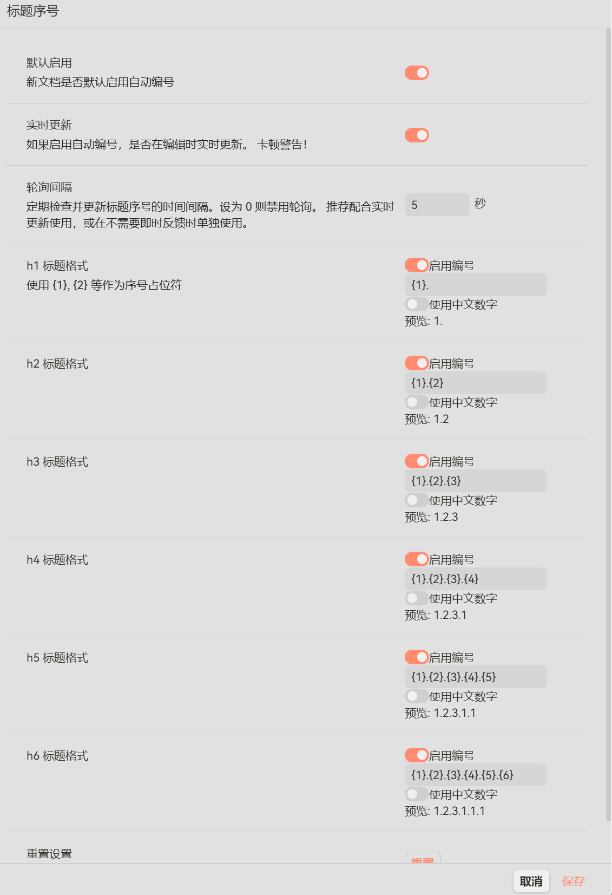

# 标题序号

github源代码地址：https://github.com/xiaohuiduan/sy-header-number
基于 [siyuan-auto-seq-number](https://github.com/zxkmm/siyuan-auto-seq-number) 二次开发的思源笔记标题自动编号插件。

## 功能特性



- **自动编号**：为 h1-h6 标题自动生成序号（在大纲和导出中均可见）
- **格式自定义**：每级标题格式可独立配置（如 `1.1`、`第1章`、`第一章`）
- **中文数字**：支持将阿拉伯数字转为中文数字
- **级别控制**：每级标题编号可独立启用/禁用
- **格式预览**：设置面板中实时预览编号效果
- **文档级开关**：每个文档独立启用/禁用编号，工具栏一键切换
- **增量更新**：只更新序号发生变化的块，减少 API 调用
- **轮询更新**：可配置轮询间隔，定期检查并更新序号
- **实时更新**：可选编辑时实时更新编号
- **批量分块**：大文档分块更新，防止超时，本地测试，100多个标题可以正常更新使用
- **禁用即清除**：禁用编号时自动去除所有已有序号

## 使用方法

安装插件后，顶部工具栏会添加一个按钮用于切换当前文档的编号状态。点击即可启用/禁用编号。编号启用时按钮高亮显示。

### 设置说明

- **默认启用**：新文档是否默认启用编号
- **实时更新**：编辑时是否实时更新编号（可能导致卡顿）
- **轮询间隔**：定期检查并更新标题序号的时间间隔（秒），设为 0 禁用轮询
- **h1-h6 标题格式**：生成的编号格式，使用 `{1}`, `{2}` 等作为序号占位符
  - 每级标题都有**启用编号**开关，可独立控制
  - 每级标题都有**使用中文数字**选项
  - 每级格式下方有**实时预览**，显示编号效果
- **重置**：将所有设置恢复为默认值（保留每个文档的启用状态）

### 格式示例

- `{1}. ` → "1. "
- `{1}.{2} ` → "1.1 "
- `第{1}章 ` → "第一章"（启用中文数字时）
- `{1}.{2}.{3} ` → "1.1.1 "

## 与原项目的差异

- 使用 `/api/outline/getDocOutline` 大纲 API 获取标题顺序，确保编号严格按文档从上到下的顺序排列
- 禁用编号时无条件清除所有已有序号，避免重复启用后序号累积
- 正确处理大纲 API 中 `&nbsp;` 编码的空格
- 新增轮询更新机制
- 增量更新时追踪内容变化，避免缓存不同步导致跳过更新

## 安装方法

1. 下载发布包
2. 解压到思源笔记的插件目录
3. 重启思源笔记
4. 在设置中启用插件

## 开发

```bash
# 安装依赖
pnpm install

# 开发模式
pnpm run dev

# 构建
pnpm run build
```

## 许可证

MIT License
